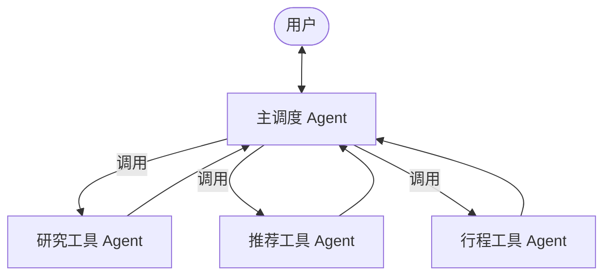

# Agent-as-Tools 概念系统提炼

> 本文档全部结论均直接引用自[agents-as-tools.md](https://strandsagents.com/latest/documentation/docs/user-guide/concepts/multi-agent/agents-as-tools/)原文

---

## 1. 概念一句话
把具备专项能力的 AI 智能体（Agent）封装成可调用的「工具函数」，由一名「主调度智能体」按需调用，实现“专业的人做专业的事”的层次化协作。

---

## 2. 核心组成（2 层 1 流）

| 层级 | 角色 | 职责 | 原文依据 |
|---|---|---|---|
| 上层 | Orchestrator（主调度） | 1. 与用户对话 2. 决定调用哪个「工具智能体」 | “A primary ‘orchestrator’ agent handles user interaction and determines which specialized agent to call” |
| 下层 | Tool-Agent（工具智能体） | 被封装成 `@tool` 函数，仅解决单一领域问题 | “Specialized ‘tool agents’ perform domain-specific tasks when called by the orchestrator” |
| 数据流 | 往返流 | 调度器 → 工具智能体 → 结果返回调度器 → 用户 | 流程图与代码示例均体现闭环：Orchestrator ↔️ Tool-Agent |

---

## 3. 设计原则（4 大收益）

| 原则 | 原文表述 | 中文提炼 |
|---|---|---|
| 分离关注 | Separation of concerns | 一 Agent 一职责，降低系统复杂度 |
| 层次委派 | Hierarchical delegation | 调度器决定“谁来干”，形成清晰指挥链 |
| 模块化 | Modular architecture | 各智能体可独立增删改，系统即插即用 |
| 性能优化 | Improved performance | 专项提示词 + 专属工具，提升单点效果 |

---

## 4. 关键实现要点（Strands SDK 视角）

1. 用 `@tool` 装饰器把 Agent 变成可调函数  
   “…through its `@tool` decorator. This allows you to transform specialized agents into callable functions…”

2. 工具函数必须写清 docstring，方便调度器选型  
   “Write descriptive docstrings that explain the agent's expertise”

3. 调度器系统提示需给出「何时用谁」的明确规则  
   “Give the orchestrator clear criteria for when to use each specialized agent”

4. 统一异常处理与返回格式，保证调度器能可靠拼接答案  
   “Use consistent patterns to extract and format responses”

---

## 5. 最小运行逻辑（Mermaid 映射）

> 该图与原文流程图一一对应，仅将英文标签译为中文。

---

## 6. 一句话总结
Agent-as-Tools 不是“让单个 Agent 更强大”，而是“把一群专业 Agent 组织成一支可插拔的工具箱”，用最小耦合实现最大协作。